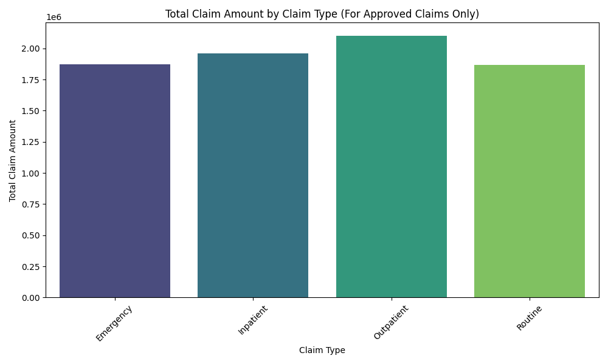
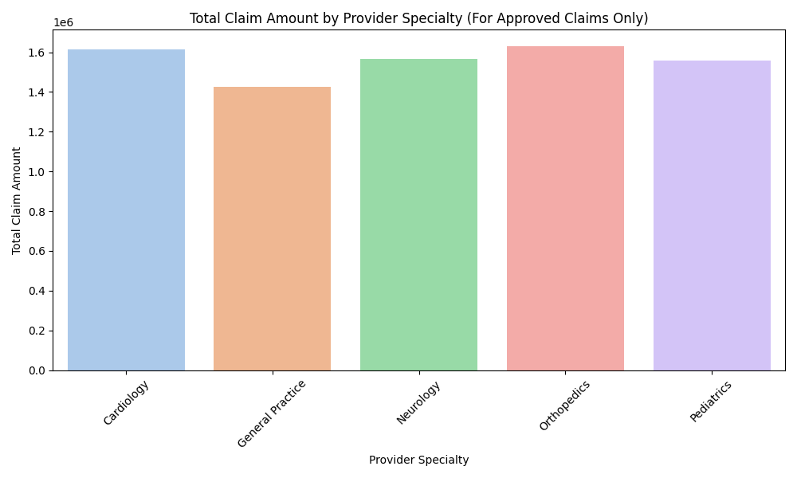
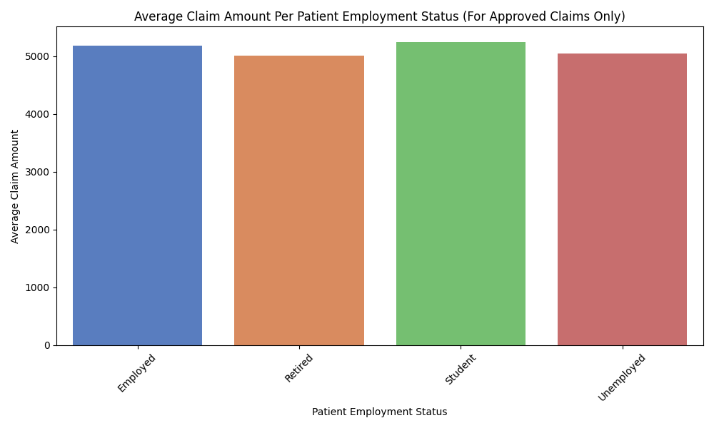
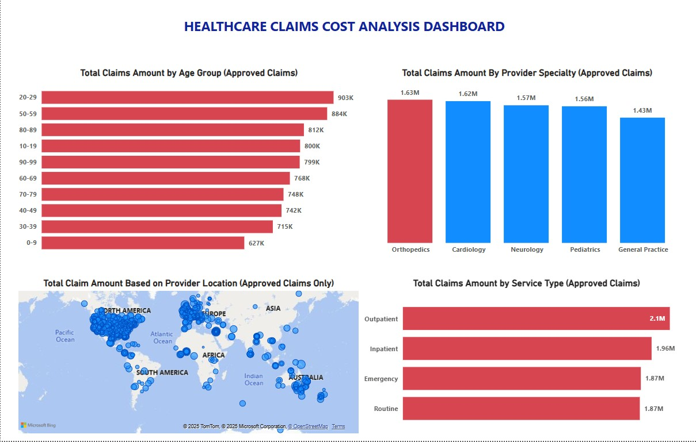

# Healthcare Claims Cost Analysis
This project analyzes synthetic healthcare claims data to identify major cost drivers and generate actionable recommendations for cost optimization.

## 🔍 Objectives
- Identify cost trends by service type, provider location, provider specialty, and patient demographics
- Visualize key insights to inform decision-making
- Recommend areas for cost reduction

## 🛠️ Tools Used
- Python (Pandas, Seaborn, Matplotlib)
- PostgreSQL (pgAdmin)
- Power BI (for interactive dashboards)

## 📊 Key Insights
- Outpatient visits were the top cost drivers, followed by inpatient visits.
  

- Orhtopedic claims contributed the most to healthcare costs
  

- Based on Patient Employment status, students accounted for the highest total healthcare claim amounts on average
  
  
- Patients aged 20-29 generated more healthcare spending than any other age group
- Based on provider location, North America and Asia account for the highest total healthcare claim amounts
  

## 📁 File Overview
- `notebooks/healthcare_cost_analysis.ipynb` – Full code and analysis
- `data/sample_claims.csv` – Cleaned dataset
- `output/` – Exported plots
- `dashboard.pbix` – Power BI dashboard 

## 📝 Recommendations
- Consider telehealth and preventive care options to reduce high-volume, high cost outpatient visits
- Promote value-based contracting with orthopedic providers and explore bundled payment models to reduce cost
- Reduce high cost utilization for patients aged 20-29 years by improving health literacy, providing behavioral health support, and championing incentive-based wellness programs to minimize acute care episodes
- Conduct a regional cost efficiency analysis to understand the underlying cost drivers in North America and Asia

## 💼 Portfolio Relevance
This project demonstrates my ability to analyze real-world healthcare data, draw insights, and communicate actionable strategies to technical and non-technical stakeholders.
